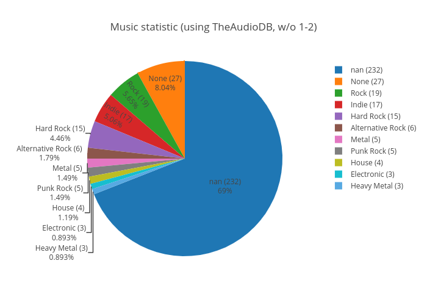

## Небольшая демонстрация диаграмм
Тут приведены результаты работы [тулзы](https://github.com/Rubikoid/vk_genre_pie_generator) на [моих аудиозаписях](https://vk.com/audios101470743). На этой странице приведены статичные картинки, если же требуется +- динамичная диаграмма (plot.ly же), имеется ссылка под картинкой. 

### LastFM
Написано gracenote, но на самом деле это LastFM.
Наименьший процент погрешностей, однако некоторые песни понять всё же не может.
Очень большой разброс жанров.

[Полная версия](genre_lfm.html)
### TheAudioDB
Немного странно, но это худший из вариантов. Правильных срабатываний очень мало.
Практически всё - в пустоту.

[Полная версия](genre_audb.html)
### GraceNode
Средний уровень погрешности. Может определить песню, там где её нет, с этим есть проблемы.
В целом - лучше, чем audioDB, но похуже, чем LastFM.
Зато разброс жанров меньше.

[Полная версия](genre_gn.html)
